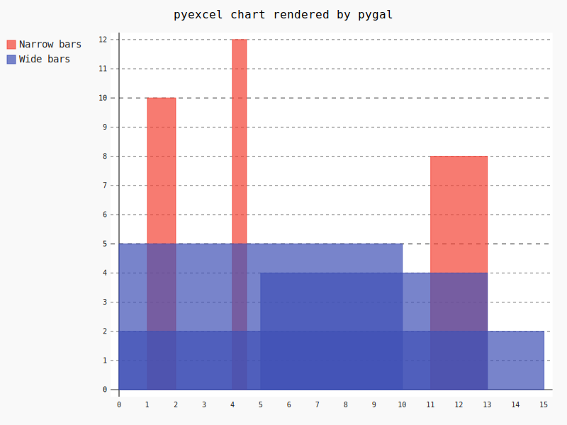
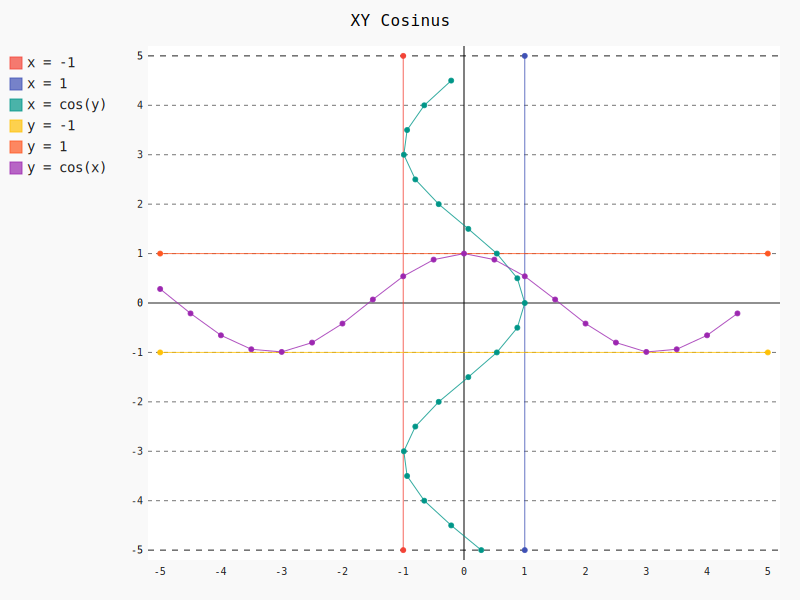
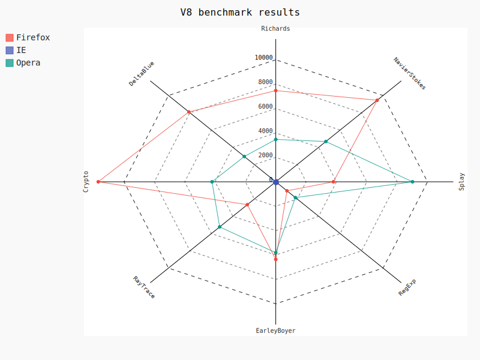

Charts
================================================================================

Histogram
--------------------------------------------------------------------------------

		   
Here is the source code using pyexcel::

    >>> import pyexcel as pe
    >>> data = {
    ...     'Wide bars': [(5, 0, 10), (4, 5, 13), (2, 0, 15)],
    ...     'Narrow bars':  [(10, 1, 2), (12, 4, 4.5), (8, 11, 13)]
    ... }
    >>> pe.save_as(
    ...     adict=data,
    ...     dest_chart_type='histogram',
    ...     dest_file_name='histogram.svg'
    ... )

Here is the source code `using pygal <http://pygal.org/en/stable/documentation/types/histogram.html#basic>`_

XY
--------------------------------------------------------------------------------

BASIC
********************************************************************************

Basic XY Lines, drawing cosinus:

		   
Here is the source code using pyexcel::

    >>> import pyexcel as pe
    >>> from math import cos
    >>> data = {
    ...     'x = cos(y)': [(cos(x / 10.), x / 10.) for x in range(-50, 50, 5)],
    ...     'y = cos(x)': [(x / 10., cos(x / 10.)) for x in range(-50, 50, 5)],
    ...     'x = 1':  [(1, -5), (1, 5)],
    ...     'x = -1': [(-1, -5), (-1, 5)],
    ...     'y = 1':  [(-5, 1), (5, 1)],
    ...     'y = -1': [(-5, -1), (5, -1)]
    ... }
    >>> pe.save_as(
    ...     adict=data,
    ...     dest_chart_type='xy',
    ...     dest_title='XY Cosinus',
    ...     dest_file_name='xy_cosinus.svg'
    ... )

Here is the source code `using pygal <http://pygal.org/en/stable/documentation/types/xy.html#basic>`_

Radar chart
--------------------------------------------------------------------------------

		   
Here is the source code using pyexcel::

    >>> title = 'V8 benchmark results'
    >>> x_labels = ['Richards', 'DeltaBlue', 'Crypto', 'RayTrace', 'EarleyBoyer', 'RegExp', 'Splay', 'NavierStokes']
    >>> data = {
    ...     'Chrome': [6395, 8212, 7520, 7218, 12464, 1660, 2123, 8607],
    ...     'Firefox': [7473, 8099, 11700, 2651, 6361, 1044, 3797, 9450],
    ...     'Opera': [3472, 2933, 4203, 5229, 5810, 1828, 9013, 4669],
    ...     'IE': [43, 41, 59, 79, 144, 136, 34, 102],
    ... }
    >>> pe.save_as(
    ...     adict=data,
    ...     dest_x_labels=x_labels,
    ...     dest_title=title,
    ...     dest_chart_type='radar',
    ...     dest_file_name='radar.svg'
    ... )

Here is the source code `using pygal <http://pygal.org/en/stable/documentation/types/radar.html#basic>`_
