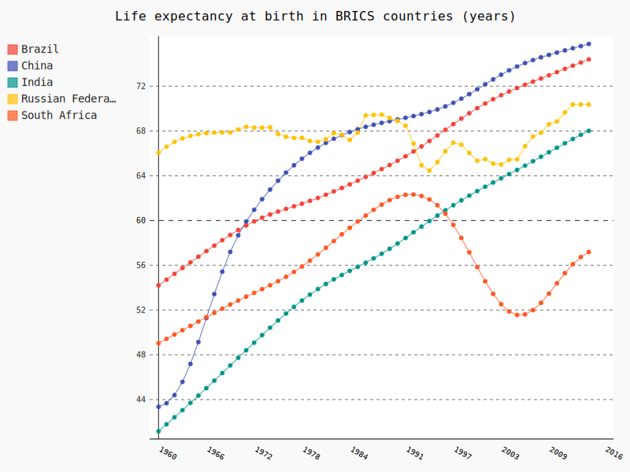

Data visualization on life expectancy
================================================================================

Data source: `Life Expectancy, The World Bank, World Development Indicators
<http://data.worldbank.org/indicator/SP.DYN.LE00.IN>`_

example::

    >>> import pyexcel as p
    >>> sheet = p.get_sheet(file_name='API_SP.DYN.LE00.IN_DS2_en_csv_v2.csv')
    >>> sheet.top_left()
    pyexcel sheet:
    +-------------------+------------------------------+----------------+----------------+------+
    | "Data Source"    | World Development Indicators |                |                |      |
    +-------------------+------------------------------+----------------+----------------+------+
    |                   |                              |                |                |      |
    +-------------------+------------------------------+----------------+----------------+------+
    | Last Updated Date | 03/01/17                     |                |                |      |
    +-------------------+------------------------------+----------------+----------------+------+
    |                   |                              |                |                |      |
    +-------------------+------------------------------+----------------+----------------+------+
    | Country Name      | Country Code                 | Indicator Name | Indicator Code | 1960 |
    +-------------------+------------------------------+----------------+----------------+------+
    >>> del sheet.row[:4]
    >>> sheet.top_left()
    pyexcel sheet:
    +--------------+--------------+-----------------------------------------+----------------+---------------+
    | Country Name | Country Code | Indicator Name                          | Indicator Code | 1960          |
    +--------------+--------------+-----------------------------------------+----------------+---------------+
    | Aruba        | ABW          | Life expectancy at birth, total (years) | SP.DYN.LE00.IN | 65.5693658537 |
    +--------------+--------------+-----------------------------------------+----------------+---------------+
    | Andorra      | AND          | Life expectancy at birth, total (years) | SP.DYN.LE00.IN |               |
    +--------------+--------------+-----------------------------------------+----------------+---------------+
    | Afghanistan  | AFG          | Life expectancy at birth, total (years) | SP.DYN.LE00.IN | 32.3285121951 |
    +--------------+--------------+-----------------------------------------+----------------+---------------+
    | Angola       | AGO          | Life expectancy at birth, total (years) | SP.DYN.LE00.IN | 32.9848292683 |
    +--------------+--------------+-----------------------------------------+----------------+---------------+
    >>> del sheet.column[1:4]
    >>> sheet.top_left()
    pyexcel sheet:
    +--------------+---------------+---------------+---------------+---------------+
    | Country Name | 1960          | 1961          | 1962          | 1963          |
    +--------------+---------------+---------------+---------------+---------------+
    | Aruba        | 65.5693658537 | 65.9880243902 | 66.3655365854 | 66.7139756098 |
    +--------------+---------------+---------------+---------------+---------------+
    | Andorra      |               |               |               |               |
    +--------------+---------------+---------------+---------------+---------------+
    | Afghanistan  | 32.3285121951 | 32.7774390244 | 33.219902439  | 33.6578780488 |
    +--------------+---------------+---------------+---------------+---------------+
    | Angola       | 32.9848292683 | 33.3862195122 | 33.7875853659 | 34.1884634146 |
    +--------------+---------------+---------------+---------------+---------------+
    >>> sheet.transpose()
    >>> sheet.top_left()
    pyexcel sheet:
    +--------------+---------------+---------+---------------+---------------+
    | Country Name | Aruba         | Andorra | Afghanistan   | Angola        |
    +--------------+---------------+---------+---------------+---------------+
    | 1960         | 65.5693658537 |         | 32.3285121951 | 32.9848292683 |
    +--------------+---------------+---------+---------------+---------------+
    | 1961         | 65.9880243902 |         | 32.7774390244 | 33.3862195122 |
    +--------------+---------------+---------+---------------+---------------+
    | 1962         | 66.3655365854 |         | 33.219902439  | 33.7875853659 |
    +--------------+---------------+---------+---------------+---------------+
    | 1963         | 66.7139756098 |         | 33.6578780488 | 34.1884634146 |
    +--------------+---------------+---------+---------------+---------------+
    >>> sheet.name_columns_by_row(0)
    >>> sheet.column.select(['Country Name', 'Brazil', 'Russian Federation', 'India', 'China', 'South Africa'])
    >>> sheet.save_as("life_expectancy_in_brics_countries.svg", chart_type='line', title='Life expectancy in BRICS countries', x_labels_major_count=10, x_label_rotation=30, show_minor_x_labels=False)
