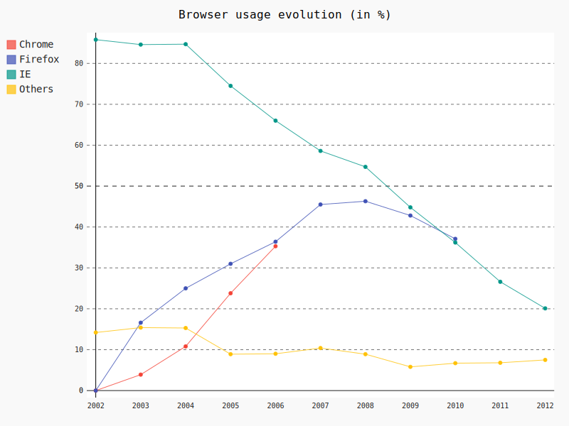
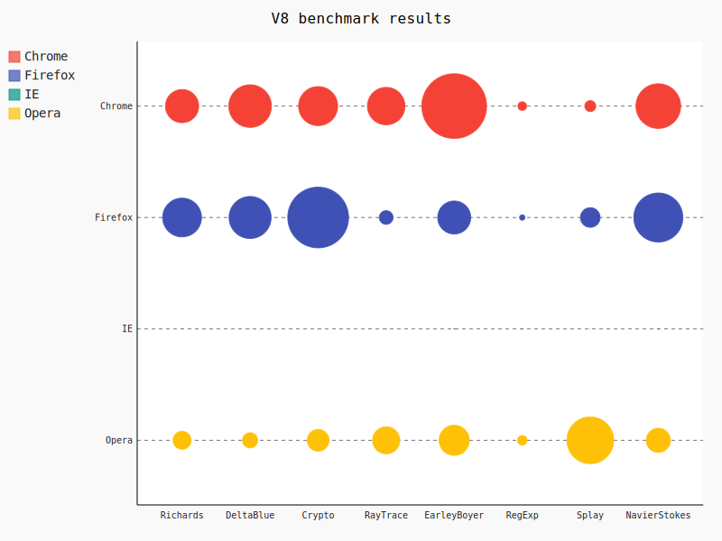
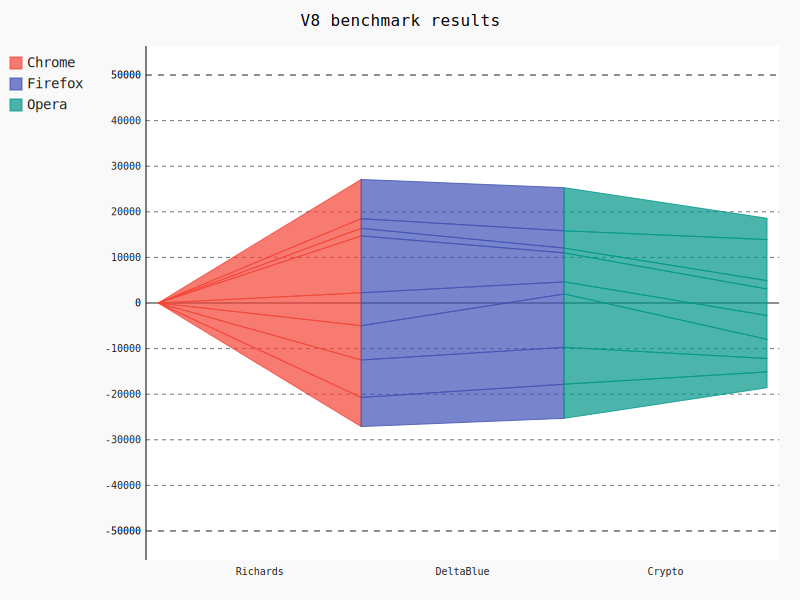
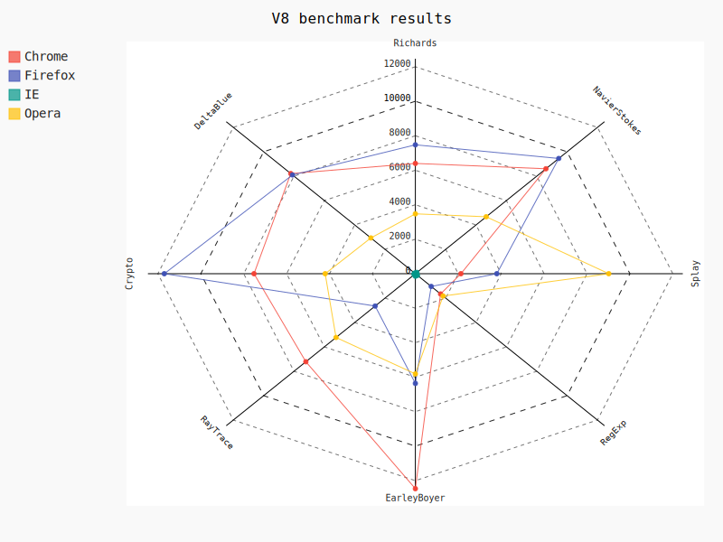
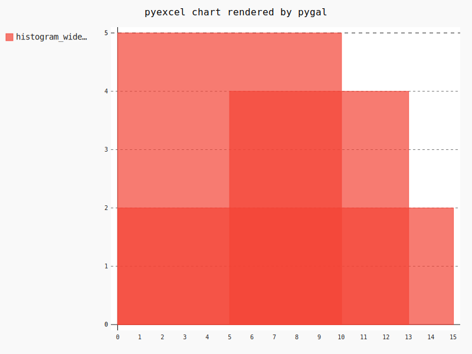
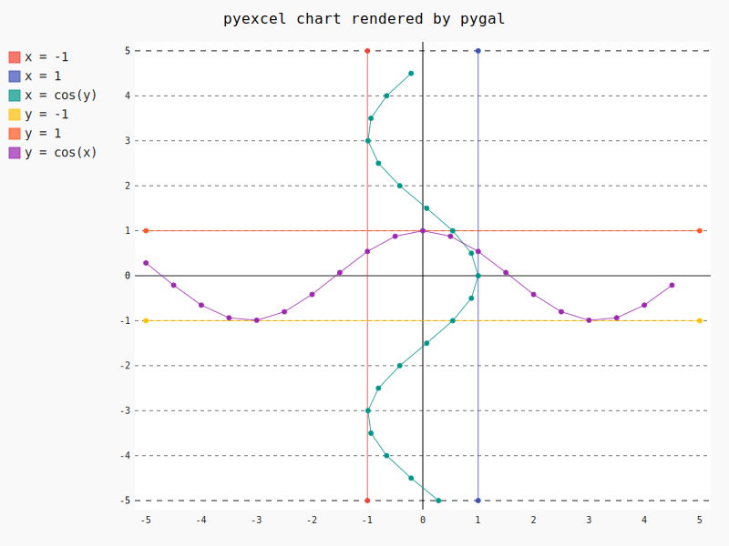

Usage
================================================================================

There are currently four type of data layouts for rendering charts. 

1 Simple Layout
--------------------------------------------------------------------------------

Series names are placed in the first row. The rest of the rows are data sets.

Pie chart
********************************************************************************

.. csv-table::
   :file: ../../pie.csv

		   
Here is the source code using pyexcel

.. pyexcel-code::

    title = 'Browser usage in February 2012 (in %)'
    sheet = pyexcel.get_sheet(file_name='pie.csv')
    svg = sheet.plot(chart_type='pie',
         title=title, width=600, height=400, explicit_size=True)

Box chart
********************************************************************************

.. csv-table::
   :file: ../../box.csv

.. image:: _static/pbox.svg
   :width: 600px
   :height: 400px
		   
Here is the source code using pyexcel::

    >>> import pyexcel as p
    >>> title = 'V8 benchmark results'	
    >>> p.save_as(file_name='box.csv', dest_chart_type='box',
    ...     dest_file_name='pbox.svg', dest_title=title)

2 Complex layout
--------------------------------------------------------------------------------

On top of previous layout, x labels were inserted as the first column. In other
words, each column represents series data and the first column contains x labels.
y labels locate in the first row

Line
********************************************************************************

.. csv-table::
   :file: ../../line.csv

		   
Here is the source code using pyexcel::

    >>> import pyexcel as p
    >>> title = 'Browser usage evolution (in %)'
    >>> p.save_as(file_name='line.csv', dest_chart_type='line',
    ...     dest_file_name='pline.svg', dest_title=title)

Dot chart
********************************************************************************

.. csv-table::
   :file: ../../radar.csv

Here is the source code using pyexcel::

    >>> import pyexcel as p
    >>> title = 'V8 benchmark results'	
    >>> p.save_as(file_name='radar.csv', dest_chart_type='dot',
    ...     dest_file_name='pdot.svg', dest_title=title)

Funnel chart
********************************************************************************

.. csv-table::
   :file: ../../funnel.csv

		   
Here is the source code using pyexcel::

    >>> import pyexcel as p
    >>> title = 'V8 benchmark results'	
    >>> p.save_as(file_name='funnel.csv', dest_chart_type='funnel',
    ...     dest_file_name='pfunnel.svg', dest_title=title)

Radar chart
********************************************************************************

.. csv-table::
   :file: ../../radar.csv

		   
Here is the source code using pyexcel::

    >>> import pyexcel as p
    >>> title = 'V8 benchmark results'	
    >>> p.save_as(file_name='radar.csv', dest_chart_type='radar',
    ...     dest_file_name='pradar.svg', dest_title=title)

Histogram
--------------------------------------------------------------------------------

To draw a histogram, heights, starts and stops should be placed sequentially
in first, second and third columns.

.. csv-table::
   :file: ../../histogram_wide_bars.csv

		   
Here is the source code using pyexcel::

    >>> import pyexcel as p
    >>> p.save_as(file_name='histogram_wide_bars.csv', dest_chart_type='histogram',
    ...     dest_file_name='phistogram_wide_bars.svg')

In order to draw multiple histogram on the same chart, you will need to use a
Book, each sheet of which become a histogram. Here is how you can draw multiple histogram.

.. image:: _static/phistogram.svg
   :width: 600px
   :height: 400px
		   
Here is the source code using pyexcel::

    >>> import pyexcel as p
    >>> p.save_book_as(file_name='histogram.xlsx', dest_chart_type='histogram',
    ...     dest_file_name='phistogram.svg')

XY
--------------------------------------------------------------------------------

In order to draw XY graph, x, y data should be placed vertically at first and
second column. In order to draw multiple lines, their data should be placed
in individual sheets.

.. csv-table::
   :file: ../../radar.csv

		   
Here is the source code using pyexcel::

    >>> import pyexcel as p
    >>> p.save_book_as(file_name='xy.xlsx', dest_chart_type='xy',
    ...     dest_file_name='pxy.svg')
