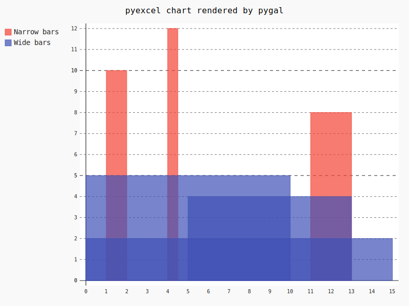

Usage
================================================================================

There are currently four type of data layouts for rendering charts.

1 Simple Layout
--------------------------------------------------------------------------------

Series names are placed in the first row. The rest of the rows are data sets.

Pie chart
********************************************************************************

.. csv-table::
   :file: ../../pie.csv

Here is the source code using pyexcel

.. pyexcel-code::

    title = 'Browser usage in February 2012 (in %)'
    sheet = pyexcel.get_sheet(file_name='pie.csv')
    svg = sheet.plot(chart_type='pie',
         title=title, width=600, height=400, explicit_size=True)

Box chart
********************************************************************************

.. csv-table::
   :file: ../../box.csv

.. image:: _static/pbox.svg
   :width: 600px
   :height: 400px

Here is the source code using pyexcel:

.. pyexcel-code::

    title = 'V8 benchmark results'
    sheet = pyexcel.get_sheet(file_name='box.csv')
    svg = sheet.plot(chart_type='box',
         title=title, width=600, height=400, explicit_size=True)

2 Complex layout
--------------------------------------------------------------------------------

On top of previous layout, x labels were inserted as the first column. In other
words, each column represents series data and the first column contains x labels.
y labels locate in the first row

Line
********************************************************************************

.. csv-table::
   :file: ../../line.csv

Here is the source code using pyexcel:

.. pyexcel-code::

    title = 'Browser usage evolution (in %)'
    sheet = pyexcel.get_sheet(file_name='line.csv')
    svg = sheet.plot(chart_type='line',
        title=title, width=600, height=400, explicit_size=True)

Dot chart
********************************************************************************

.. csv-table::
   :file: ../../radar.csv

Here is the source code using pyexcel:

.. pyexcel-code::

    title = 'V8 benchmark results'
    sheet = pyexcel.get_sheet(file_name='radar.csv')
    svg = sheet.plot(chart_type='dot',
        title=title, width=600, height=400, explicit_size=True)

Funnel chart
********************************************************************************

.. csv-table::
   :file: ../../funnel.csv

Here is the source code using pyexcel::

    title = 'V8 benchmark results'
    sheet = p.get_sheet(file_name='funnel.csv')
    svg = sheet.plot(chart_type='funnel',
        title=title, width=600, height=400, explicit_size=True)

Radar chart
********************************************************************************

.. csv-table::
   :file: ../../radar.csv

Here is the source code using pyexcel::

.. pyexcel-code::

    title = 'V8 benchmark results'
    sheet = pyexcel.get_sheet(file_name='radar.csv')
    svg = sheet.plot(chart_type='radar',
        title=title, width=600, height=400, explicit_size=True)

Histogram
--------------------------------------------------------------------------------

To draw a histogram, heights, starts and stops should be placed sequentially
in first, second and third columns.

.. csv-table::
   :file: ../../histogram_wide_bars.csv

Here is the source code using pyexcel:

.. pyexcel-code::

    sheet = pyexcel.get_sheet(file_name='histogram_wide_bars.csv')
    svg = sheet.plot(chart_type='histogram',
         width=600, height=400, explicit_size=True)

In order to draw multiple histogram on the same chart, you will need to use a
Book, each sheet of which become a histogram. Here is how you can draw multiple histogram.

Here is the source code using pyexcel

.. pyexcel-code::

    book = pyexcel.get_book(file_name='histogram.xlsx')
    svg = book.plot(chart_type='histogram',
         width=600, height=400, explicit_size=True)

XY
--------------------------------------------------------------------------------

In order to draw XY graph, x, y data should be placed vertically at first and
second column. In order to draw multiple lines, their data should be placed
in individual sheets.

.. csv-table::
   :file: ../../radar.csv

Here is the source code using pyexcel

.. pyexcel-code::

    book = pyexcel.get_book(file_name='xy.xlsx')
    svg = book.plot(chart_type='xy',
         width=600, height=400, explicit_size=True)
