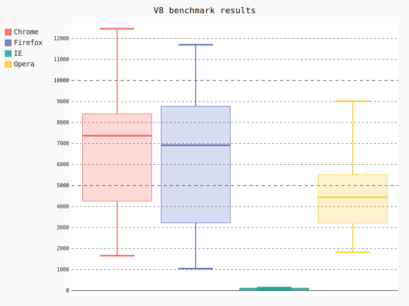

Line
--------------------------------------------------------------------------------

.. image:: _static/pline.svg
   :width: 600px
   :height: 400px
		   
Here is the source code using pyexcel::

    >>> import pyexcel as p
    >>> title = 'Browser usage evolution (in %)'
    >>> p.save_as(file_name='line.csv', dest_chart_type='line',
    ...     dest_file_name='pline.svg', dest_title=title)

Histogram
--------------------------------------------------------------------------------

.. image:: _static/phistogram_wide_bars.svg
   :width: 600px
   :height: 400px
		   
Here is the source code using pyexcel::

    >>> import pyexcel as p
    >>> p.save_as(file_name='histogram_wide_bars.csv', dest_chart_type='histogram',
    ...     dest_file_name='phistogram_wide_bars.svg')

Here is how you can draw multiple histogram.

.. image:: _static/phistogram.svg
   :width: 600px
   :height: 400px
		   
Here is the source code using pyexcel::

    >>> import pyexcel as p
    >>> p.save_book_as(file_name='histogram.xlsx', dest_chart_type='histogram',
    ...     dest_file_name='phistogram.svg')

XY
--------------------------------------------------------------------------------

		   
Here is the source code using pyexcel::

    >>> import pyexcel as p
    >>> p.save_book_as(file_name='xy.xlsx', dest_chart_type='xy',
    ...     dest_file_name='pxy.svg')

Pie chart
--------------------------------------------------------------------------------

		   
Here is the source code using pyexcel::

    >>> import pyexcel as p
    >>> title = 'Browser usage in February 2012 (in %)'
    >>> p.save_as(file_name='pie.csv', dest_chart_type='pie',
    ...     dest_file_name='ppie.svg', dest_title=title)

Radar chart
--------------------------------------------------------------------------------

.. image:: _static/pradar.svg
   :width: 600px
   :height: 400px
		   
Here is the source code using pyexcel::

    >>> import pyexcel as p
    >>> title = 'V8 benchmark results'	
    >>> p.save_as(file_name='radar.csv', dest_chart_type='radar',
    ...     dest_file_name='pradar.svg', dest_title=title)

Box chart
--------------------------------------------------------------------------------

		   
Here is the source code using pyexcel::

    >>> import pyexcel as p
    >>> title = 'V8 benchmark results'	
    >>> p.save_as(file_name='box.csv', dest_chart_type='box',
    ...     dest_file_name='pbox.svg', dest_title=title)

Dot chart
--------------------------------------------------------------------------------

		   
Here is the source code using pyexcel::

    >>> import pyexcel as p
    >>> title = 'V8 benchmark results'	
    >>> p.save_as(file_name='radar.csv', dest_chart_type='dot',
    ...     dest_file_name='pdot.svg', dest_title=title)

Funnel chart
--------------------------------------------------------------------------------

		   
Here is the source code using pyexcel::

    >>> import pyexcel as p
    >>> title = 'V8 benchmark results'	
    >>> p.save_as(file_name='funnel.csv', dest_chart_type='funnel',
    ...     dest_file_name='pfunnel.svg', dest_title=title)

